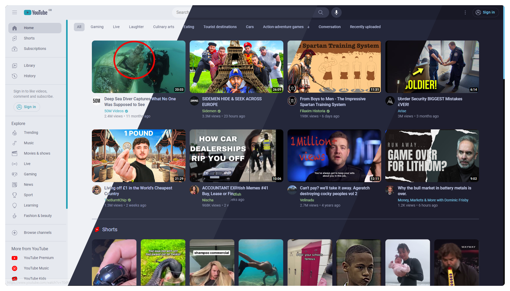
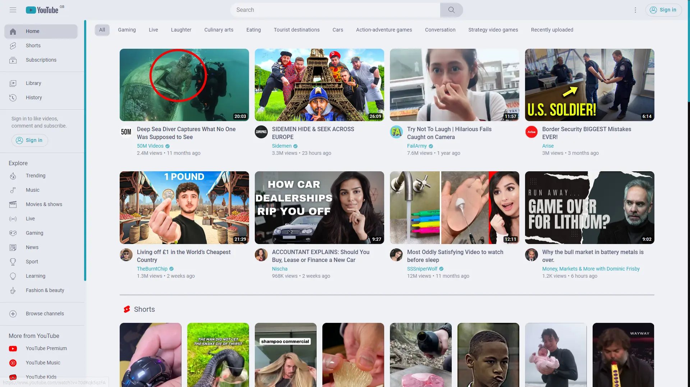
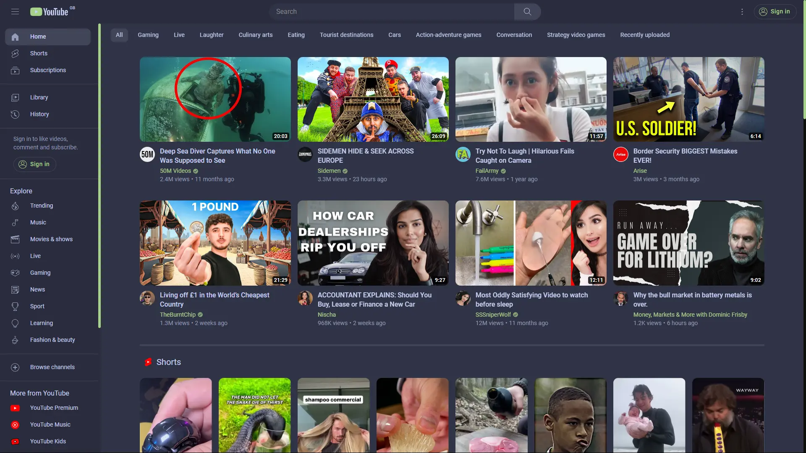
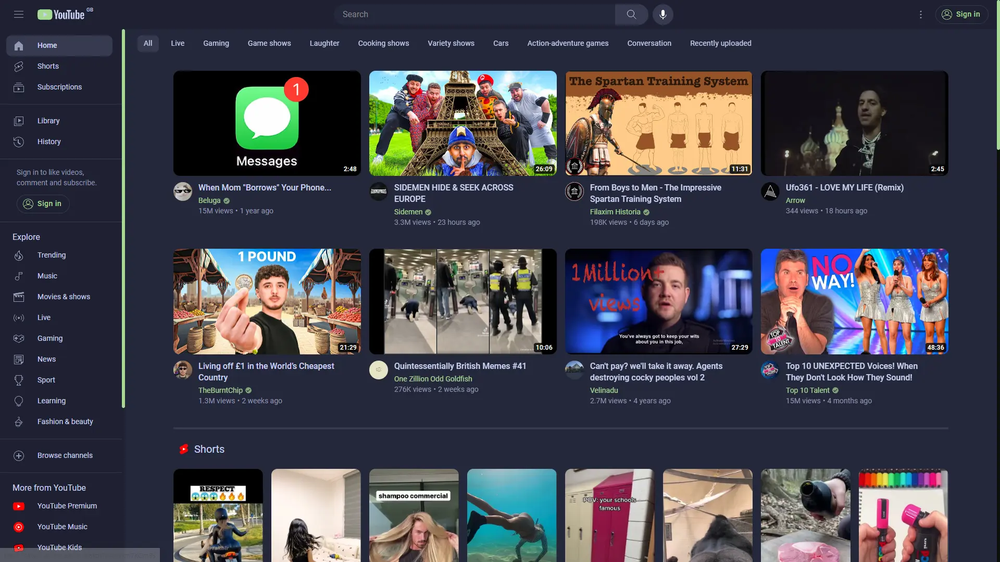
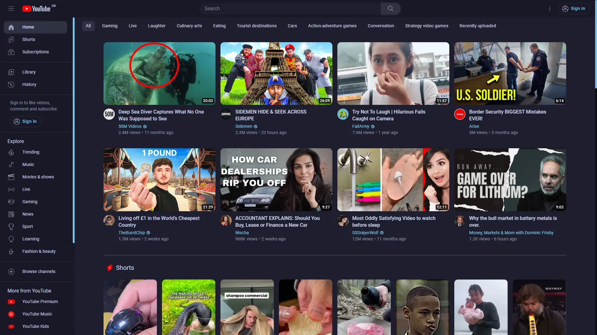
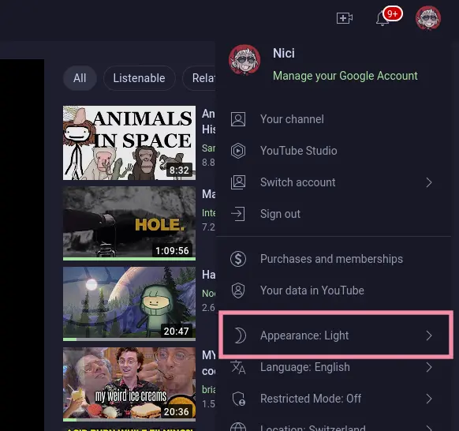
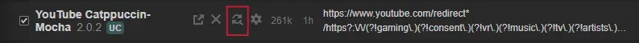

<h3 align="center">
	 
	
	Catppuccin for <a href="https://www.youtube.com">YouTube</a>
	
</h3>

  

## Previews

🌻 Latte

  

🪴 Frappé

  

🌺 Macchiato

  

🌿 Mocha

  

## 🙋 FAQ

-	Q: **_"The colors look wrong?"_**\
	A:  

            

                5. Make sure your base youtube theme is set to light mode
            

            
        

-   Q: **_"This thing is broken!!!"_**\
    A: 

            

                6. Remember to update occationally
            

            
            You may have to press the button twice to do the update
        

## 💝 Thanks to

- [Isabel](https://github.com/isabelroses) - v2.0.0 youtube theme
- [rubyowo](https://github.com/rubyowo)
- [Elkrien](https://github.com/elkrien) - v1.0.0 youtube theme
- [Artilate](https://github.com/artilate/youtube) - this theme is made by modification of great YouTube rose pine theme

&nbsp;

Copyright &copy; 2021-present <a href="https://github.com/catppuccin" target="_blank">Catppuccin Org</a>

